

Advanced mapping
========================================================
author: Andrew Ba Tran
date: November 4, 2015

New York Times
========================================================

<a href="http://www.nytimes.com/interactive/2015/10/31/upshot/who-still-doesnt-have-health-insurance-obamacare.html?_r=1">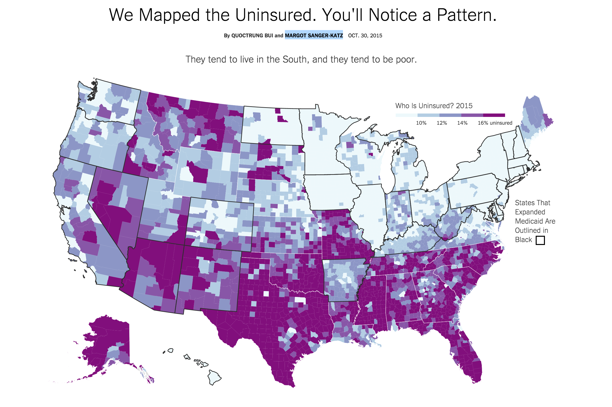</img></a>

NPR
========================================================

<a href="http://www.npr.org/news/graphics/2011/10/toxic-air/#5.00/39.849/-94.503">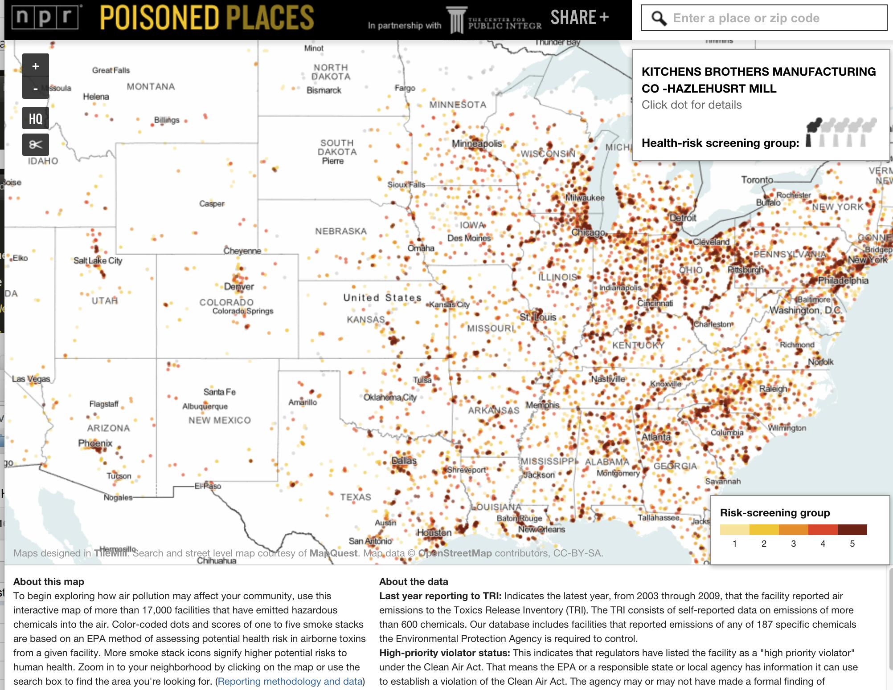</img></a>

New York Times
========================================================

<a href="http://www.nytimes.com/interactive/2015/05/03/upshot/the-best-and-worst-places-to-grow-up-how-your-area-compares.html?_r=1">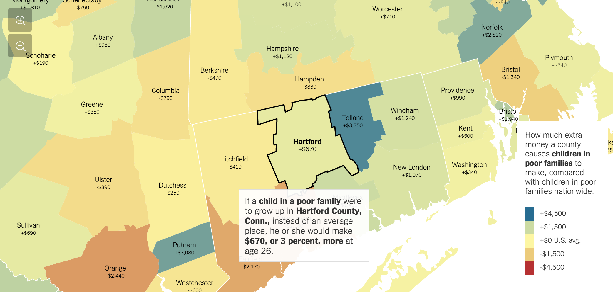</img></a>

The Upshot uses geolocation to push readers deeper into data
- [Nieman Journalism Lab](http://www.niemanlab.org/2015/05/the-upshot-uses-geolocation-to-push-readers-deeper-into-data/)

All the Lonely People
========================================================

<a href="http://www.iliablinderman.com/connections/">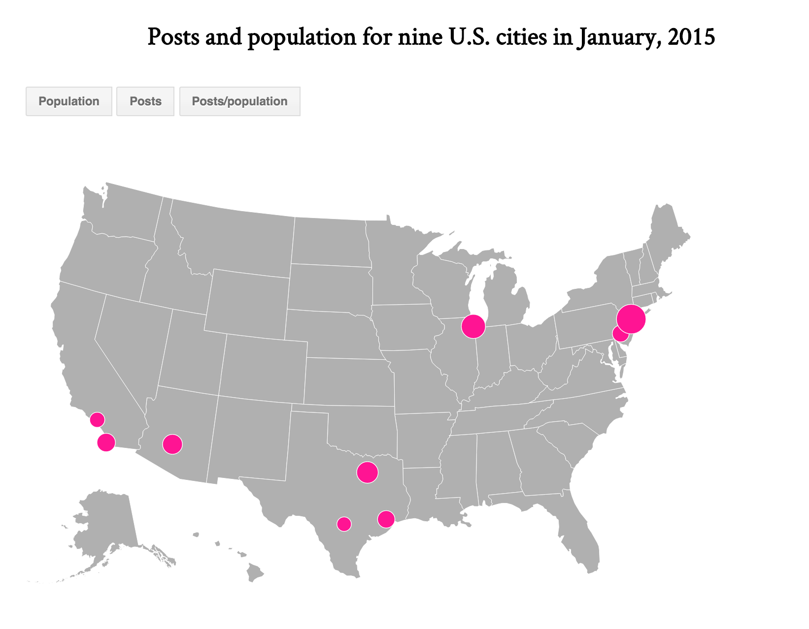</img></a>

Blizzard of 2015 
========================================================

### It was a record-breaking winter. 

**What are some ideas for data visualizations?**

Give me five ideas.

WNYC's Data News
========================================================

Embeddable radar

<a href="http://project.wnyc.org/storm-radar/">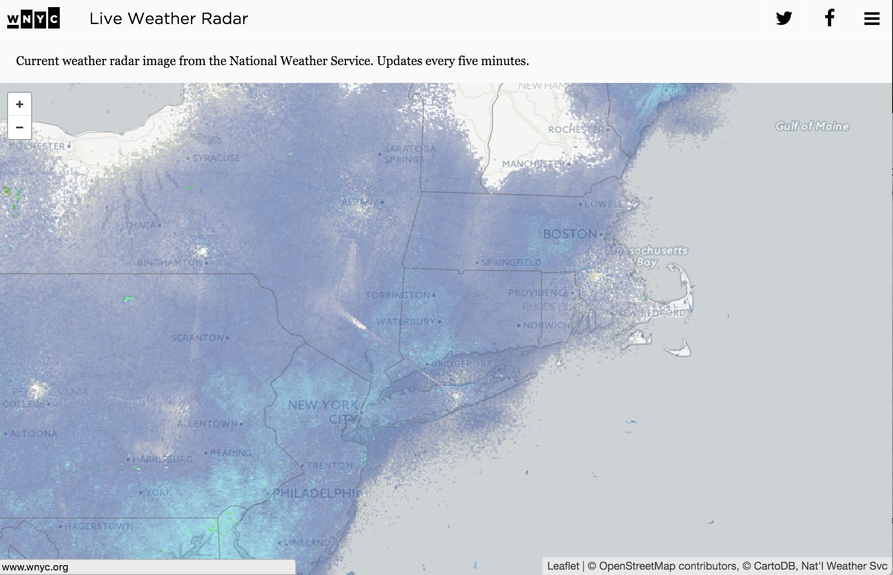</img></a>

WNYC's Data News
========================================================

Transit tracker

<a href="http://project.wnyc.org/transit-tracker/">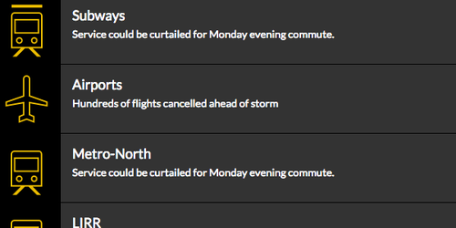</img></a>

WNYC's Data News
========================================================

Traffic map

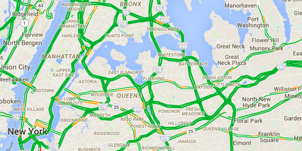</img>

The New York Times
========================================================
A dashboard to track the status of airports, trains, and schools in NYC.

<a href="http://www.nytimes.com/interactive/2015/01/25/nyregion/storm-new-york-city-status.html?_r=2">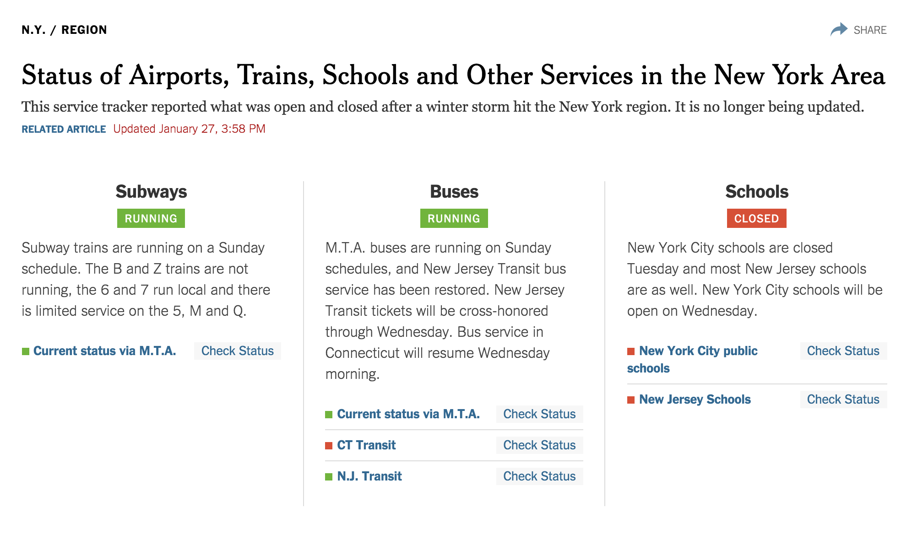</img></a>

The Boston Globe
========================================================
Static map of snow accumulation

<a href="http://www.bostonglobe.com/2014/01/09/snow-totals-mass-northeast/badi2tA5EWGipQN6xjPX3L/story.html">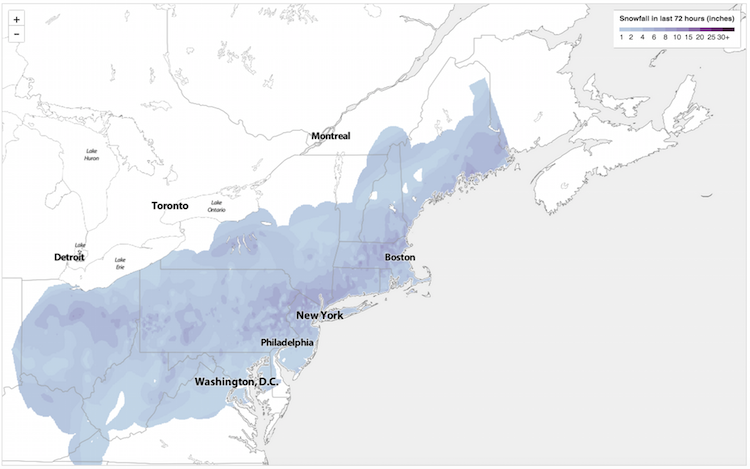</img></a>

The Boston Globe
========================================================
Static chart of snow accumulation

<a href="https://www.bostonglobe.com/metro/2015/03/15/parade-day-snow-but-snowiest-winter-record-unlikely-today/BCxfh7yPtIrxtHVzty5sPM/story.html"></img></a>

The Boston Globe
========================================================
Interactive chart of snow accumulation

<a href="http://www.bostonglobe.com/2014/01/09/snow-totals-mass-northeast/badi2tA5EWGipQN6xjPX3L/story.html">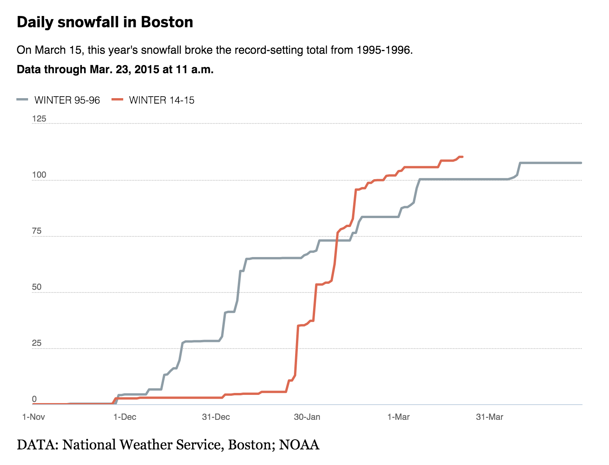</img></a>

WindyTY
========================================================
Global weather conditions visualization

<a href="http://earth.nullschool.net/">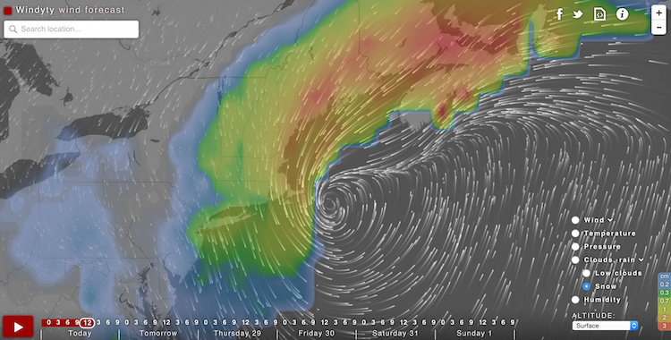</img></a>

WindyTY
========================================================
Global weather conditions visualization (<a href="https://github.com/cambecc/earth">open source</a>)

<a href="http://earth.nullschool.net/"></img></a>

Smithsonian
========================================================
Geo-tagged social media updates related to the storm

<a href="http://www.smithsonianmag.com/smart-news/use-map-track-snowfall-and-social-media-buzz-around-northeast-blizzard-180954025/?no-ist">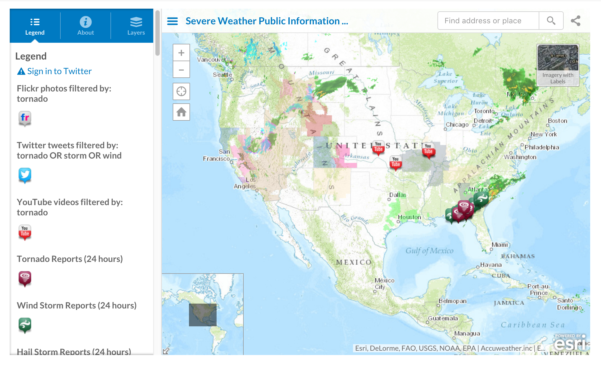</img></a>

Bloomberg
========================================================
Charting flight delays and cancellations

<a href="http://www.bloomberg.com/news/articles/2015-01-27/the-east-coast-becomes-a-no-fly-zone"></img></a>

The Guardian
========================================================
Collage of live camera feeds

<a href="http://www.theguardian.com/us-news/ng-interactive/2015/jan/26/-sp-live-photos-juno-blizzard-snowmaggedon-2015"></img></a>

You
========================================================
A timelapse snow plow map

<a href="http://andrewbtran.github.io/JRN-418/class11/cartodb">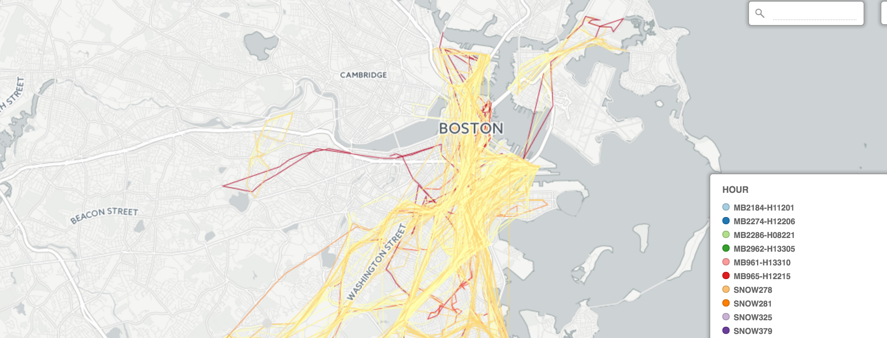</img></a>

