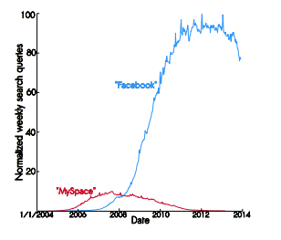
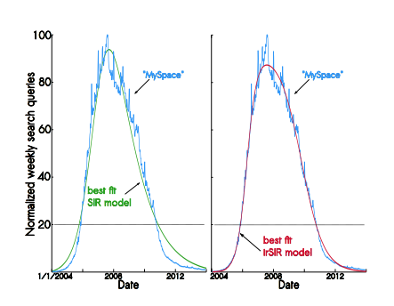
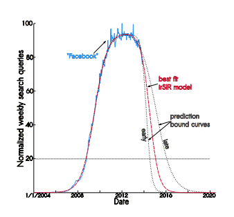
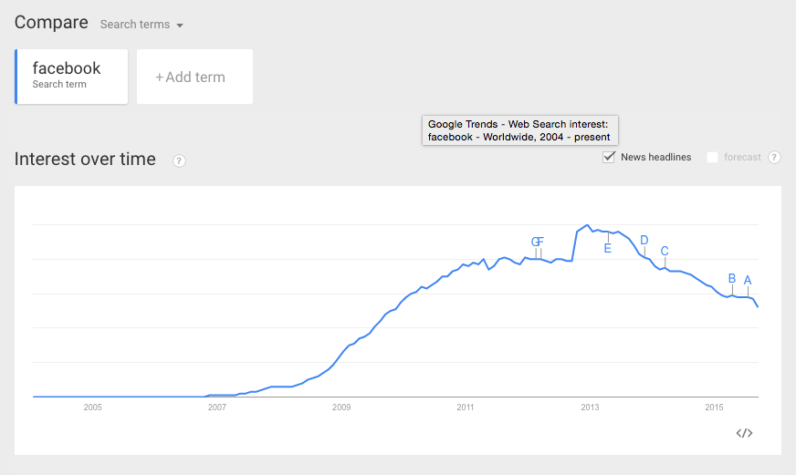
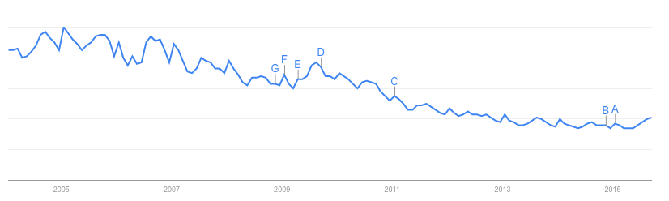
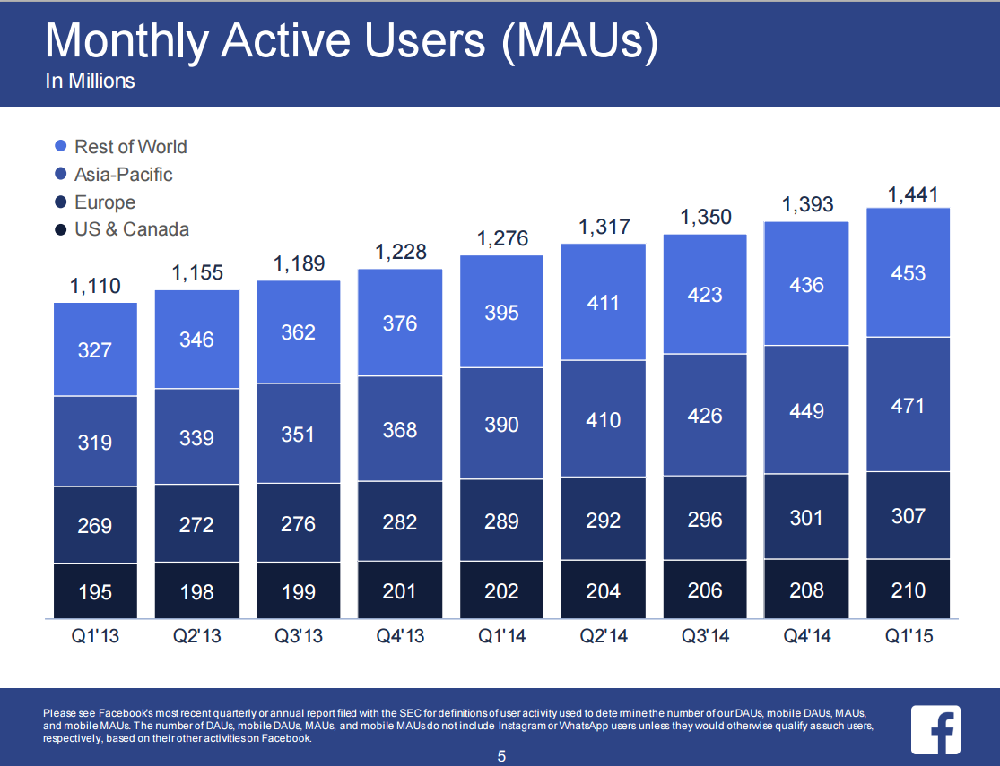

Facebook study
========================================================
author: Andrew Ba Tran
date: September 16, 2005

Facebook declining?
========================================================

</img>

Facebook declining?
========================================================

***"Facebook will undergo a rapid decline in the coming years, losing 80 percent of its peak user base between 2015 and 2017."***

* The forecast of Facebook's impending doom was made by comparing the growth curve of epidemics to those of online social networks. 

* Scientists argue that, like bubonic plague, Facebook will eventually die out.

* Princeton forecast says it will lose 80% of its peak user base within the next three years.

Facebook declining?
========================================================

</img>

Facebook declining?
========================================================

</img>

Facebook declining?
========================================================

Nothing sells on Facebook like another story about how Facebook is evil, uncool, or—best of all—doomed.

* A Social networks’ growth can be likened to the spread of an infectious disease.
* In the case of Myspace, the network’s decline can also be likened to the spread of an infectious disease.
* Like Myspace, Facebook has begun to show signs of decline after a period of rapid growth.
* Ergo, Facebook will be dead within three years.

A Social networks’ growth can be likened to the spread of an infectious disease
========================================================

No sh*t. That's why they call it "viral".

In the case of Myspace, the network’s decline can also be likened to the spread of an infectious disease
========================================================

Instead of comparing the decline of social networks to recovery from an illness, the authors make an interesting leap. 

They hypothesize instead that the decline of a social network is like the spread of an illness—that leaving is as contagious as joining.

Like Myspace, Facebook has begun to show signs of decline after a period of rapid growth
========================================================

There’s a huge spike in October 2012 that the researchers can’t really explain and end up simply throwing out.

</img>

Like Myspace, Facebook has begun to show signs of decline after a period of rapid growth
========================================================

Why not use Facebook's registration and membership data?
* "typically proprietary and difficult to obtain."

Google Trends is not the best analytic to base this type of conclusion on

</img>

Facebook declining!
========================================================

* [Study: Facebook to Lose 80 Percent of Users, Become the Next MySpace | News & Opinion | PCMag.com](http://www.pcmag.com/article2/0,2817,2429794,00.asp)

* [Facebook will lose 80% of users by 2017, say Princeton researchers | Technology | The Guardian](http://www.theguardian.com/technology/2014/jan/22/facebook-princeton-researchers-infectious-disease)

* [Facebook is an 'infectious disease' and will lose 80% of users by 2017, according to researchers - Gadgets and Tech - Life and Style - The Independent](http://www.independent.co.uk/life-style/gadgets-and-tech/facebook-is-an-infectious-disease-and-will-lose-80-of-users-by-2017-say-researchers-9079342.html)

* [Controversial Paper Predicts Facebook Decline - Digits - WSJ](http://blogs.wsj.com/digits/2014/01/22/controversial-paper-predicts-facebook-decline/)

It’s an old journalistic trick
========================================================

* Just add the words "research" or "study" to a sensational claim for instant credibility. 

* Best of all, you’re absolved of any responsibility for verifying its truth, since everyone knows journalists aren’t qualified to dispute scientific findings.

Facebook declining? Nope
========================================================

* Monthly active users (MAUs) were 1.44 billion as of March 31, 2015, an increase of 13% year-over-year.

</img>

The takeaways
========================================================

* Always question the methodology
* Be skeptical about analytics
* If it's based on a study, has it been peer-reviewed yet?
