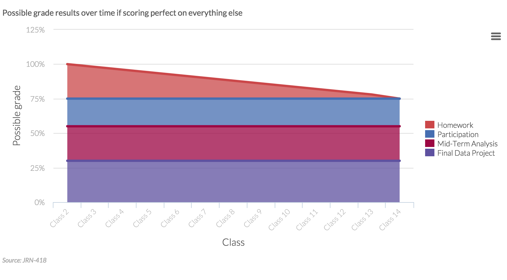

Digging for data in a story
========================================================
author: Andrew Tran
date: September 16, 2015

**Welcome to class 3**

Internships!
========================================================

It's that time of the season to start applying

- [NYU Journalism internship, job listings ](http://journalism.nyu.edu/career-services/job-and-internship-listings/)
- [Data Journalism Jobs](http://datajournalismjobs.com/)
- [Data Journalism Jobs - Silk](http://data-journalism-jobs.silk.co/)

DO YOUR WORK
========================================================

[Seriously, do your homework](http://projects.ctmirror.org/tools/chart/charts/Doyourwork-3-8-2015-87298.html)

</img>

Spotlight
========================================================

[movie](https://www.youtube.com/watch?v=EwdCIpbTN5g)

<iframe width="560" height="315" src="https://www.youtube.com/embed/Zg5zSVxx9JM" frameborder="0" allowfullscreen></iframe>
