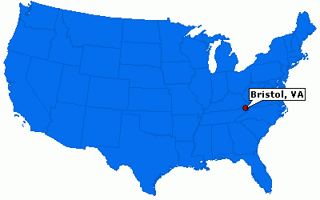
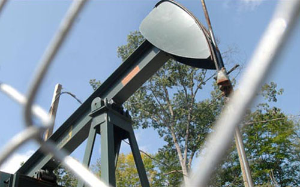
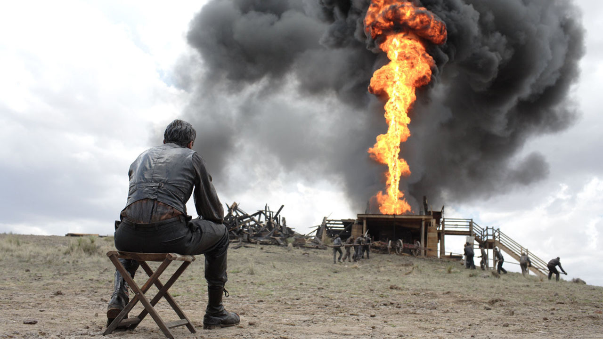
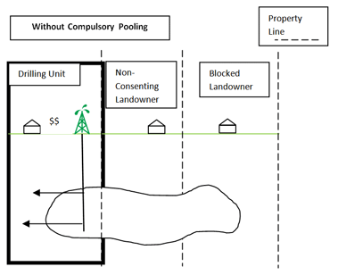
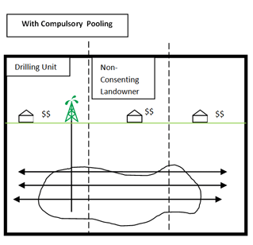

The Bristol Herald Courier story analysis
========================================================
author: Andrew Tran
date: September 23, 2015

Bristol Herald Courier
========================================================

</img>

Bristol Herald Courier by the numbers
========================================================

Daily circulation: 
* 30,000

Staff reporters: 
* 7

Story quota per week: 
* 3 to 4

Furloughs: 
* 15 days = 5.8 percent pay cut

The story: Royalties for leasing mineral rights to oil and gas companies
========================================================

</img>

Oil
========================================================

</img>

Who owns it?
========================================================

</img>

Fairness
========================================================
<iframe width="853" height="480" src="https://www.youtube.com/embed/a5d9BrLN5K4" frameborder="0" allowfullscreen></iframe>

Forced pooling
========================================================

</img>

1990
========================================================
**The Virginia Gas and Oil Act**

- A way to develop Virginia's coalbed methane without having to deal with who actually owns the land it came from

- Eminent domain called **force pooling** that allowed gas companies to pull the gas on land 

- Can't find out who land owners or property under dispute? 

 - **Then the royalties are put in a state escrow.**

How it started
========================================================
* Attended a hearing of the Virginia Gas and Oil Board
 * Met landowners who were incensed that corporations were draining their gas against their will and not paying them for the intrusion.
* Not a new issue.
 * “Two prior managing editors had spiked the story”

> Royalties, methane gas, escrow accounts—it’s not the sexiest story.

How it would have normally gone
========================================================

With these facts alone, he could have written a stellar story giving voice to citizens’ complaints, and shining a light on a little-known regulatory agency. 

**That, in many newsrooms, would have been plenty for an HS3 story.**

**(He said/She said)**

The question
========================================================

**Are landowners not getting paid for gas extracted from wells on their land?**

What data exists? 
========================================================

Whenever a well produced natural gas, the energy company was supposed to make a monthly payment into a corresponding escrow account.

* Companies report monthly gas production numbers to the state for an online database
* The escrow account is maintained by Wachovia Bank, which reports monthly statements to the Division of Gas and Oil

**Match the production records with the payment schedules to see who had-- and had not-- been paid.**

The process
========================================================

After FOIAing the data, the reporter received spreadsheets with thousands of rows.

Started with one month's worth of data.

Looked in one spreadsheet for a well and then looked in another to see if that well existed in the other.

One by one
========================================================

Control-f

Control-f

Control-f

Control-f

Control-f

Control-f

Control-f

Taking too long
========================================================

Needed advance training fromthe Investigative Reporters and Editors group.

They offer a six-day workshop at the University of Missouri on spreadsheets and sophisticated database management. 

Just had to convince his bosses.

Cost:
* 1,240
* A week of no copy

The pitch
========================================================

The reporter's boss called up the publisher "with a few cans of Red Bull and a bottle of vodka."

> They covered a variety of business issues, and “at the end of the night, I sprung the Boot Camp on him,” Foster recalls. “He said, ‘Is it worth it?’ I said, ‘It’s worth it. And in April, it might really be worth it.’ ”  Soon Gilbert was on his way to Missouri.

The data analysis
========================================================

Cleaning the data
* Spent weeks making sure the name sof the gas wells on the escrow statement matched the well names on the production report
* Often the data was off by a single white space, by a hyphen, or by a combination of letters.

Combining and comparing the data

* Show me the accounts that correspond to where oil or gas has been produced, but royalties have not been paid.

Reproduce the process
========================================================

Download the datasets

* [DMME - Division of Gas and Oil - Escrow Agent Summaries](https://www.dmme.virginia.gov/DGO/DgoEscrowAgentSummaries.shtml)

* [Division of Gas and Oil Data Information System](https://www.dmme.virginia.gov/dgoinquiry/frmMain.aspx?ctl=9)

* Follow along here [Joining with Google Fusion Tables](http://andrewbtran.github.io/JRN-418/class4/joining/)

The story
========================================================

* State did not monitor gas industry's compliance
* The Billion-dollar energy conglomerates don't always make the required payments into the escrow
* Of about **750** active individual accounts in the escrow, between **22 percent** and **55 percent** received no royalty payments

Who is supposed to take care of it?
========================================================
* 7 people on a Governor-appointed board who meet monthly. They get $50 per meeting.
 * 1 retired college professor
 * 2 college administrators
 * 1 former cattle farmer
 * 1 rep from the coal industry
 * 1 rep from the gas and oil industry
 * 1 state energy official, who acts as chairman
* 2 employees from the Division of Gas and Oil

What happened?
========================================================
* Lack of staffing
* No audits
* No compliance checks

> Gas companies were essentially on the honor system.

Even more complicated
========================================================

**Coal versus gas**

Many landowners sold their coal rights a century ago.

**Coal-mine methane** is a form of natural gas extracted from coal beds.

State Supreme Court in 2004 said a gas owner who sold only coal retained full rights to coalbed methane. 

But still a pain to get. 

Gas owner has to sue to prove ownership or agree to split royalties with the coal owner-- usually a corporation.

Until then, the money gets deposited into the escrow. 

The nutgraf
========================================================

- hundreds of individual accounts in escrow received no royalty payments during months when the corresponding gas wells produced. 
- gas corporations failed to submit the necessary paperwork for royalties to be escrowed, and other cases where payments simply weren’t made.
- raised serious questions about what is missing from escrow, as well as the state’s ability to ensure companies comply with the law.

Specifically
========================================================

- On average, 30 percent of sub-accounts in escrow each month received no royalty payments even though they corresponded to wells producing gas.

- For 10 of the 18 months, 190 sub-accounts received no deposits even though the corresponding wells produced gas.

- For all 18 months, 94 sub-accounts received no deposits even though the corresponding wells produced gas.

- Gas operators sometimes failed to submit the necessary paperwork for royalties to be escrowed, meaning that some wells have produced for years and no royalties have been deposited into escrow, creating the false impression that they are inactive.

- The escrow fund is rife with accounting and administrative errors

The scope
========================================================

> Since 1999, energy companies have more than doubled the number of wells that drain natural gas in Southwest Virginia, producing 128 billion cubic feet of gas last year - a quantity that would fetch $1.2 billion for gas producers at average regional prices for 2008.

.

>  In 10 years, the total funds in escrow have ballooned from $3.6 million to more than $24 million – all without a single audit to determine if energy companies are making the legally required deposits into escrow.

The effects of the story
========================================================

* Gas escrow finally audited
* Virginia Gas and Oil Board Chairman thanked the Bristol Herald Courier for looking into it. Also thanked the two employees who cooperated with the paper.
* Two natural gas industry reps attacked the story.
 * Said it was too one-sided
 
> “Unfortunately, that whole issue was not explained in those eight articles and 15-some thousand words. And that’s the core issue.”

The effects of the story
========================================================
* Searchable database online for payments
* One landowner's account originally had $1.56
 * After the story, his account had $44,440.
* Month later, energy corporations deposited five times the normal average into the accounts.
* Won the Pulitzer Prize for Public Service.

 
