Data Visualizations
========================================================
author: Andrew Tran
date: October 7, 2015

Types of Data Visualizations
========================================================

## Caveat: These are types of static (as in not interactive) data visualizations

1D/Linear
========================================================

## Table / List of items 

*Usually not visualized*

</img>

1D/Linear
========================================================

## Table / List of items 

* [Responsive Table Generator](http://russellgoldenberg.github.io/responsive-table-generator/)

2D/Planar (expecially geospatial)
========================================================

## Choropleth

<a href="http://www.flickr.com/people/sadrzy/">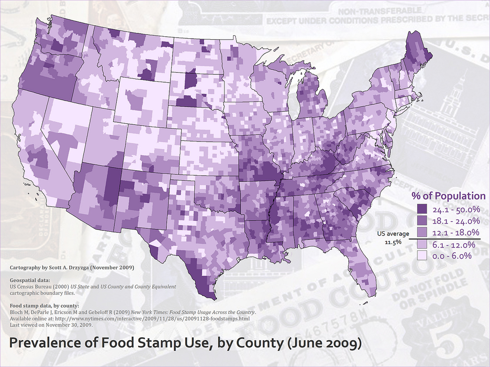</img></a>

2D/Planar (expecially geospatial)
========================================================

## Choropleth resources

* [Google Fusion Tables](http://code.google.com/apis/fusiontables/)
* [Leaflet](http://leafletjs.com/examples/choropleth.html)
* [Polymaps](http://polymaps.org/)
* [d3](http://d3js.org/)/[Protovis](http://mbostock.github.com/protovis/ex/choropleth.html)
* [Tableau Public](https://public.tableau.com/s/blog/2011/04/choropleth-counties)
* [TileMill](http://mapbox.com/tilemill/)
* [CartoDB](https://cartodb.com/)
* [Mr. Map Generator](http://patrickgarvin.com/maps/)
* [Cloudstitch](http://www.cloudstitch.com/newsroom?)

2D/Planar (expecially geospatial)
========================================================

## Cartogram

<a href="http://www.flickr.com/photos/jason-morrison/2998016737">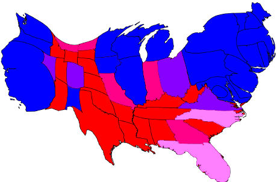</img></a>

2D/Planar (expecially geospatial)
========================================================

## Cartogram resources
* [d3](http://d3js.org/)/[Protovis](http://mbostock.github.com/protovis/ex/choropleth.html)
* [tableau](http://www.clearlyandsimply.com/clearly_and_simply/2015/06/create-your-own-cartograms-in-tableau.html)

2D/Planar (expecially geospatial)
========================================================

## Dot distribution map

<a href="http://projects.nytimes.com/census/2010/explorer">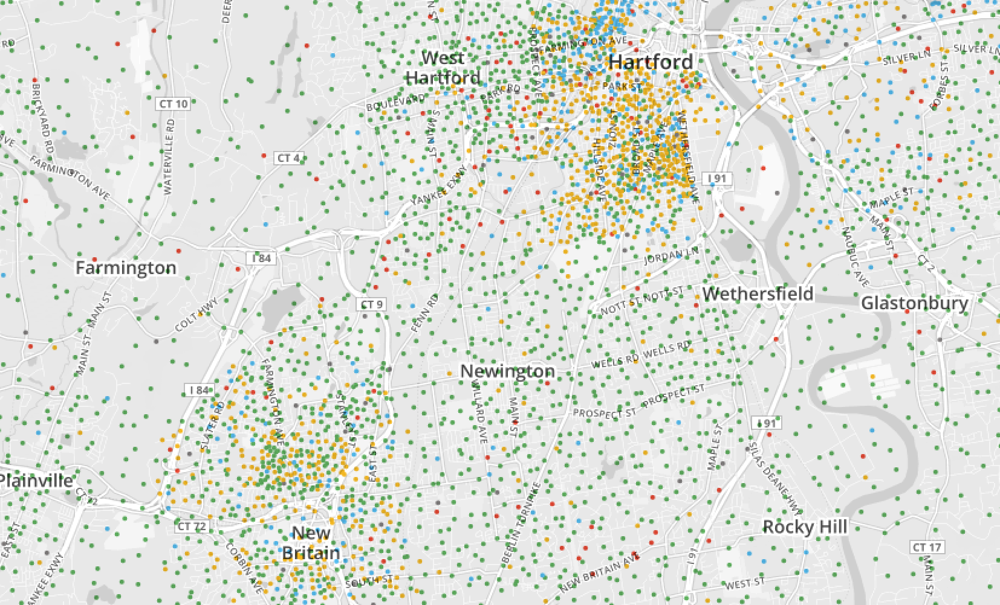</img></a>

2D/Planar (expecially geospatial)
========================================================

## Dot distribution map resources

* [Google Fusion Tables](http://code.google.com/apis/fusiontables/)
* [ArcGIS Online](http://www.esri.com/software/arcgis/arcgisonline)
* [Polymaps](http://polymaps.org/)
* [Tableau Public](https://public.tableau.com/s/)
* [Sci2](https://sci2.cns.iu.edu/)
* [TileMill](http://mapbox.com/tilemill/)

2D/Planar (expecially geospatial)
========================================================

## Proportional symbol map

<a href="http://www.nytimes.com/interactive/2015/09/14/world/middleeast/syria-war-deaths.html">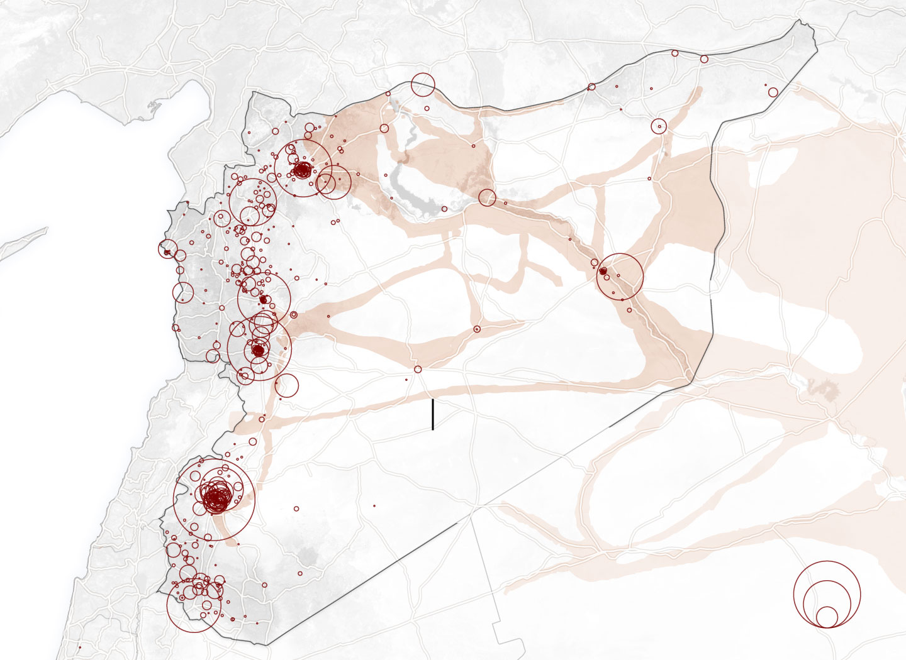</img></a>

2D/Planar (expecially geospatial)
========================================================

## Proportional symbol map resources

* [Google Fusion Tables](http://code.google.com/apis/fusiontables/)
* [Leaflet](http://leafletjs.com/examples/choropleth.html)
* [ArcGIS Online](http://www.esri.com/software/arcgis/arcgisonline)
* [Polymaps](http://polymaps.org/)
* [d3](http://d3js.org/)/[Protovis](http://mbostock.github.com/protovis/ex/choropleth.html)
* [Tableau Public](https://public.tableau.com/s/blog/2011/04/choropleth-counties)
* [Sci2](https://sci2.cns.iu.edu/)
* [TileMill](http://mapbox.com/tilemill/)
* [CartoDB](https://cartodb.com/)

2D/Planar (expecially geospatial)
========================================================

## contour/isopleth/isarithmic map

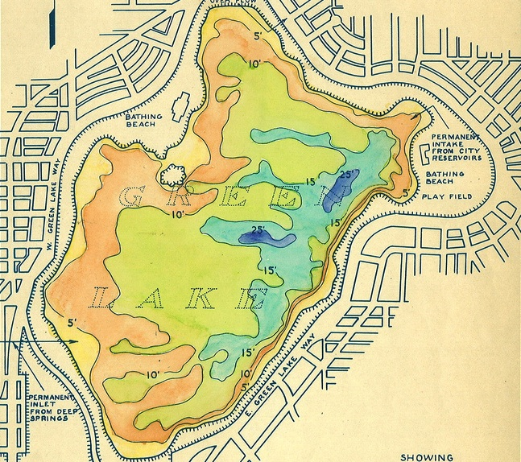</img>

2D/Planar (expecially geospatial)
========================================================

## contour/isopleth/isarithmic resources

* [Google Fusion Tables](http://code.google.com/apis/fusiontables/)
* [TileMill](http://mapbox.com/tilemill/)
* [CartoDB](https://cartodb.com/)

2D/Planar (expecially geospatial)
========================================================

## dasymetric map

<a href="https://upload.wikimedia.org/wikipedia/commons/b/bf/USDA_Hardiness_zone_map.jpg"></img></a>

2D/Planar (expecially geospatial)
========================================================

## dasymetric map resources

* [Google Fusion Tables](http://code.google.com/apis/fusiontables/)
* [TileMill](http://mapbox.com/tilemill/)
* [CartoDB](https://cartodb.com/)

3D/Volumetric
========================================================

<a href="http://www.nytimes.com/interactive/2015/03/19/upshot/3d-yield-curve-economic-growth.html"></img></a>

3D/Volumetric
========================================================
## Resources
* [d3](http://d3js.org/)

Temporal
========================================================
## Timeline

<a href="http://bulger.wbur.org/story/1977/?location=44444">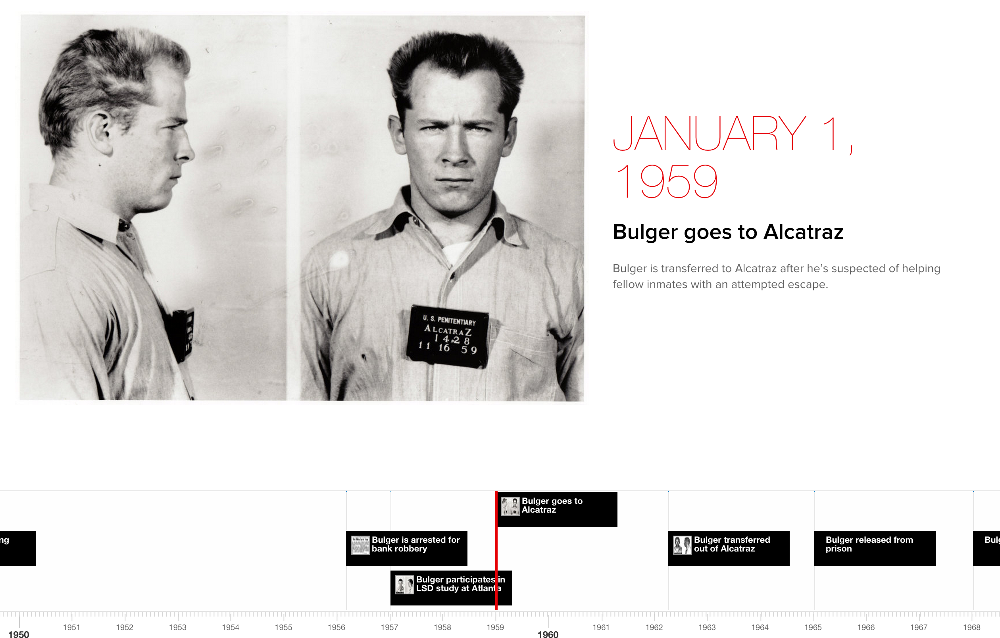</img></a>

Temporal
========================================================
## Timeline resources

* [Timeline JS](https://timeline.knightlab.com/)
* [Tik Tok](http://datanews.github.io/tik-tok/)

Temporal
========================================================
## Fever chart (time series)

<a href="http://trendct.org/2015/10/01/connecticut-per-capita-personal-income-over-time/">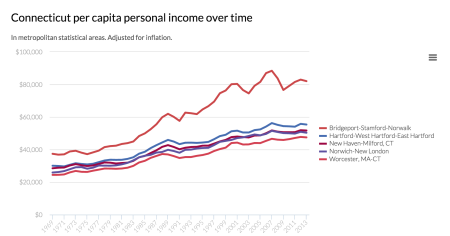</img></a>

Temporal
========================================================
## Fever chart (time series) resources

* [Datawrapper](https://datawrapper.de/)
* [Chartbuilder 2.0](https://quartz.github.io/Chartbuilder/)
* [Charted](http://www.charted.co/)
* [MetricsGraphics.js](http://metricsgraphicsjs.org/)
* [Chartist](http://gionkunz.github.io/chartist-js/)
* [Plotly](http://plot.ly)
* [Highcharts](http://www.highcharts.com/demo)

Temporal
========================================================
## Connected scatter plot

<a href=""></img></a>

Temporal
========================================================
## Connected scatter plot resources

* [Datawrapper](https://datawrapper.de/)
* [Chartbuilder 2.0](https://quartz.github.io/Chartbuilder/)
* [Charted](http://www.charted.co/)
* [MetricsGraphics.js](http://metricsgraphicsjs.org/)
* [Chartist](http://gionkunz.github.io/chartist-js/)
* [Plotly](http://plot.ly)
* [Highcharts](http://www.highcharts.com/demo)

Temporal
========================================================
## Gantt chart

</img>

Temporal
========================================================
## Steam graph/ThemeRiver

<a href="http://www.nytimes.com/interactive/2008/02/23/movies/20080223_REVENUE_GRAPHIC.html"></img></a>

Temporal
========================================================
## Steam graph/ThemeRiver resources
* [Original Java](https://github.com/leebyron/streamgraph)
* [Datawrapper](https://datawrapper.de/)
* [d3](http://d3js.org/)/[Protovis](http://mbostock.github.com/protovis/ex/stream.html)

Temporal
========================================================
## Arc diagram

<a href="http://lgimages.s3.amazonaws.com/data/imagemanager/62927/arc-protovis.png"></img></a>

Temporal
========================================================
## Arc diagram resources
* [d3](http://d3js.org/)/[Protovis](http://mbostock.github.com/protovis/ex/arc.html)
* [U.S. Gun Deaths in 2013](http://guns.periscopic.com/?year=2013)
Temporal
========================================================
## Polar area/rose/circumplex chart

<a href="http://lgimages.s3.amazonaws.com/data/imagemanager/62927/circumplex-excelcharts.png"></img></a>

Temporal
========================================================
## Polar area/rose/circumplex chart resources
* [Protovis](http://mbostock.github.com/protovis/ex/crimea-rose.html)
* [Excel](http://www.excelcharts.com/blog/the-consultants-chart-revisited/)

Temporal
========================================================
## Sankey diagram

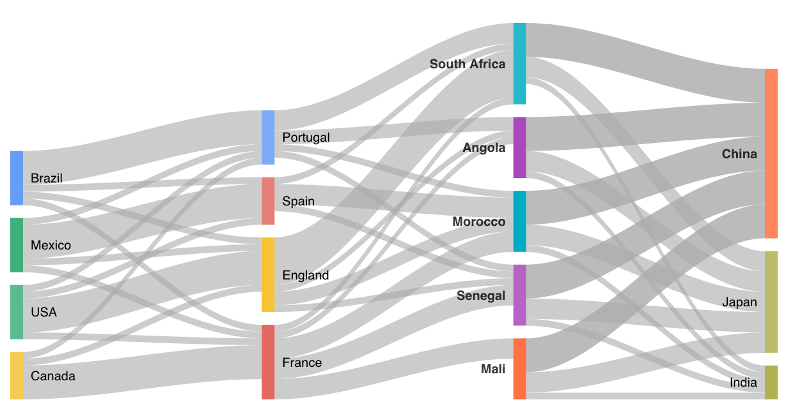</img>

Temporal
========================================================
## Sankey diagram resources
* [d3](https://github.com/d3/d3-plugins/tree/master/sankey)
* [SankeyMATIC (BETA)](http://sankeymatic.com/)
* [Google charts](https://developers.google.com/chart/interactive/docs/gallery/sankey)

nD/Multidimensional
========================================================

# Category proportions, counts

nD/Multidimensional
========================================================
## Pie charts

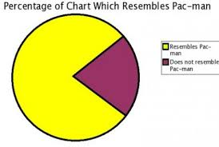</img>

nD/Multidimensional
========================================================
## Pie charts resources

* [Pie Charts Are Bad](https://www.stevefenton.co.uk/2009/04/pie-charts-are-bad/)
* [Pie Charts Are The Worst](http://www.businessinsider.com/pie-charts-are-the-worst-2013-6)
* [Countdown of Top 10 Reasons to Never Ever Use a Pie Chart](https://blogs.oracle.com/experience/entry/countdown_of_top_10_reasons_to_never_ever_use_a_pie_chart)
* [People, Please Stop Using Pie Charts](http://www.entrepreneur.com/article/239932)

nD/Multidimensional
========================================================
## Histogram

<a href="http://trendct.github.io/ct-tickets/ticket_time_analysis.html">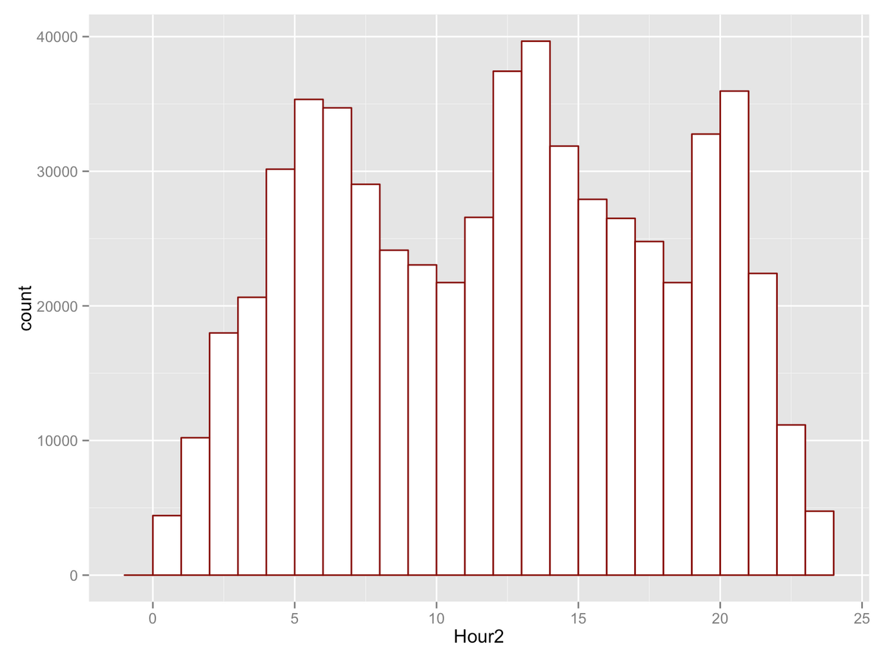</img></a>

nD/Multidimensional
========================================================
## Histogram resources

* [Protovis](http://mbostock.github.com/protovis/ex/histogram.html)
* [Plotly](http://plot.ly)
* [Tableau Public](https://public.tableau.com/s/)

nD/Multidimensional
========================================================
## Word cloud

<a href="http://images.fastcompany.com/upload/iran-wiki.jpg"></img></a>

nD/Multidimensional
========================================================
## Word cloud resources

* [Wordle](http://www.wordle.net/)
* [d3-cloud](https://github.com/jasondavies/d3-cloud)
* [Word clouds considered harmful](http://www.niemanlab.org/2011/10/word-clouds-considered-harmful/)

nD/Multidimensional
========================================================
## unordered bubble chart/bubble cloud

<a href="http://lgimages.s3.amazonaws.com/data/imagemanager/62927/bubble-d3.png
"></img></a>

nD/Multidimensional
========================================================
## unordered bubble chart/bubble cloud resources

* d3 / [Protovis](http://mbostock.github.com/protovis/ex/bubble.html)
* [Cloudstitch](http://www.cloudstitch.com/newsroom)

nD/Multidimensional
========================================================
## Bar chart / Radial chart

<a href="http://trendct.org/2015/09/30/how-has-gdp-by-industry-in-connecticuts-metro-areas-changed-over-time/
">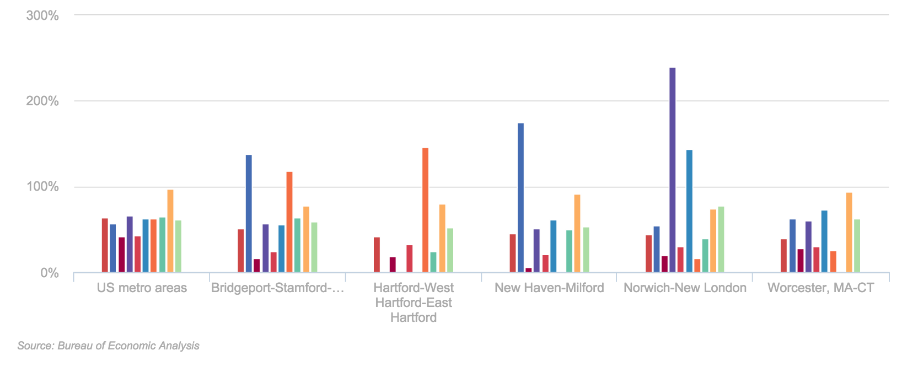</img></a>

nD/Multidimensional
========================================================
## Bar chart / Radial chart resources

* [Responsive Bar Chart Generator](http://russellgoldenberg.github.io/responsive-barchart-generator/)
* [Datawrapper](https://datawrapper.de/)
* [Chartbuilder 2.0](https://quartz.github.io/Chartbuilder/)
* [Charted](http://www.charted.co/)
* [MetricsGraphics.js](http://metricsgraphicsjs.org/)
* [Chartist](http://gionkunz.github.io/chartist-js/)
* [Plotly](http://plot.ly)
* [Highcharts](http://www.highcharts.com/demo)
* [Tableau Public](https://public.tableau.com/s/)
* [Silk.co](http://silk.co)

nD/Multidimensional
========================================================
## Tree map

<a href="http://www.nytimes.com/packages/html/newsgraphics/2011/0119-budget/index.html">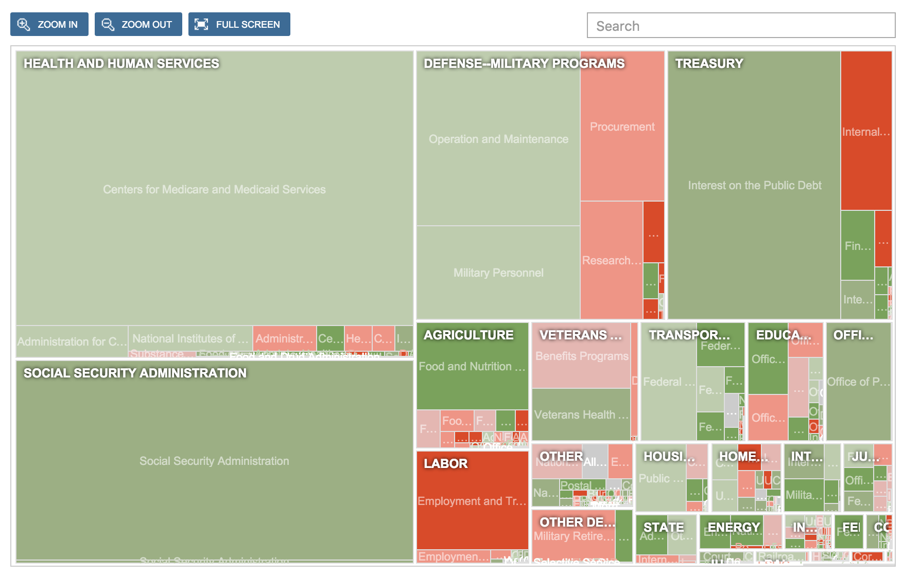</img></a>

nD/Multidimensional
========================================================
## Tree map resources

* d3/[Protovis](http://mbostock.github.com/protovis/ex/treemap.html)
* [Google charts](https://developers.google.com/chart/)
* [Tableau Public](https://public.tableau.com/s/)
* [Silk.co](http://silk.co)

nD/Multidimensional
========================================================

# Relationships between variables

nD/Multidimensional
========================================================
## Scatter plot

<a href="http://trendct.org/2015/08/04/tickets-correlation-quiz/">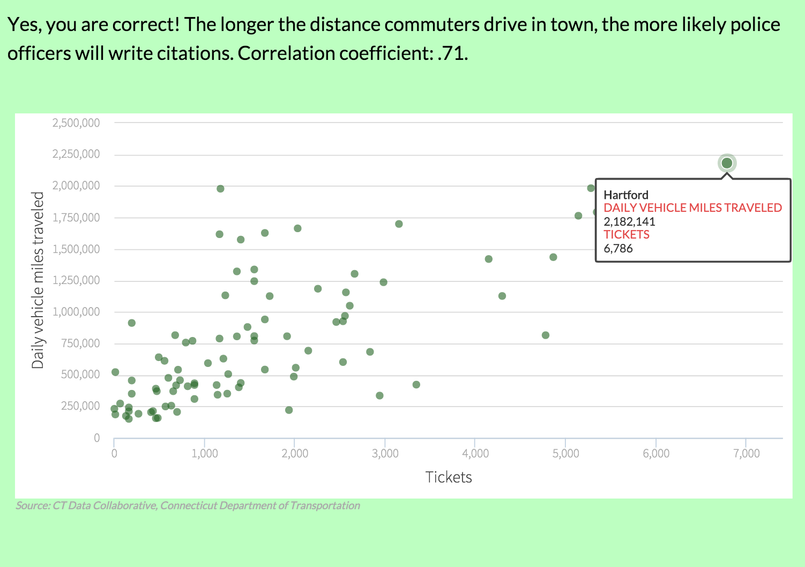</img></a>

nD/Multidimensional
========================================================
## Scatter plot resources

* [Google charts](https://developers.google.com/chart/)
* [Google Fusion Tables](http://code.google.com/apis/fusiontables/)
* [Tableau Public](https://public.tableau.com/s/)
* [Plotly](http://plot.ly)
* [Silk.co](http://silk.co)

nD/Multidimensional
========================================================
## Bubble chart

<a href="http://fivethirtyeight.blogs.nytimes.com/2011/08/22/theres-room-for-more-g-o-p-candidates/"></img></a>

nD/Multidimensional
========================================================
## Bubble chart resources

* [Google charts](https://developers.google.com/chart/)
* [Google Fusion Tables](http://code.google.com/apis/fusiontables/)
* [Tableau Public](https://public.tableau.com/s/)
* [Plotly](http://plot.ly)
* [Silk.co](http://silk.co)
* [Highcharts](http://www.highcharts.com/demo)

nD/Multidimensional
========================================================
## Line chart (fever chart)

<a href="http://vis4.net/blog/posts/doing-the-line-charts-right/"></img></a>

nD/Multidimensional
========================================================
## Line chart (fever chart) resources

* [Google charts](https://developers.google.com/chart/)
* [Tableau Public](https://public.tableau.com/s/)
* [Plotly](http://plot.ly)
* [Silk.co](http://silk.co)
* [Datawrapper](https://datawrapper.de/)
* [Chartbuilder 2.0](https://quartz.github.io/Chartbuilder/)
* [Charted](http://www.charted.co/)
* [MetricsGraphics.js](http://metricsgraphicsjs.org/)
* [Chartist](http://gionkunz.github.io/chartist-js/)
* [Highcharts](http://www.highcharts.com/demo)

nD/Multidimensional
========================================================
## Step charts

<a href="http://www.highcharts.com/stock/demo/step-line">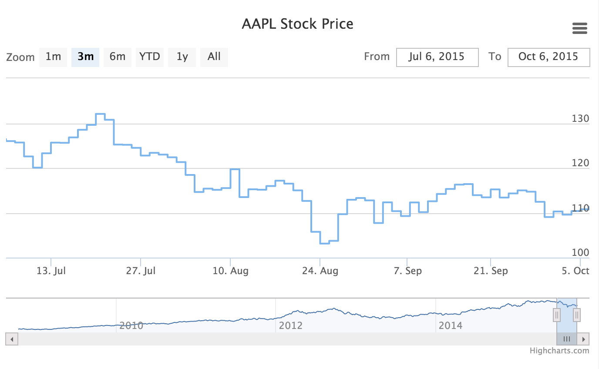</img></a>

nD/Multidimensional
========================================================
## Step charts resources
* [Google charts](https://developers.google.com/chart/)
* [Highcharts](http://www.highcharts.com/demo)
* [Protovis](http://mbostock.github.com/protovis/ex/line.html)

nD/Multidimensional
========================================================
## Area chart/stacked graph

<a href="http://trendct.org/2015/06/23/employment-in-connecticut-11-business-sector-trend-charts/">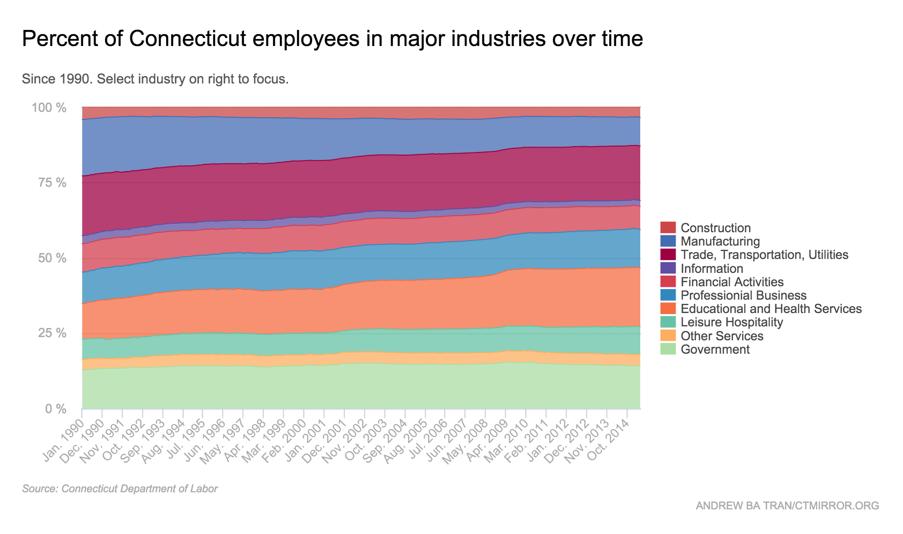</img></a>

nD/Multidimensional
========================================================
## Area chart/stacked resources

* [Google charts](https://developers.google.com/chart/)
* [Highcharts](http://www.highcharts.com/demo)
* [Protovis](http://mbostock.github.com/protovis/ex/jobs.html)
* [Plotly](http://plot.ly)

nD/Multidimensional
========================================================
## Heat map

<a href="https://www.bostonglobe.com/2014/11/24/massachusetts-turnpike-traffic-trends-before-thanksgiving/ZEqupITO63pF63Dk9WAsXK/story.html">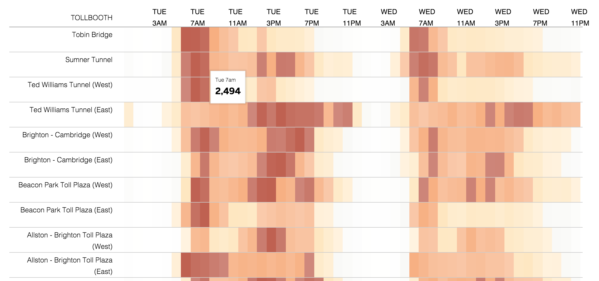</img></a>

nD/Multidimensional
========================================================
## Heat map resources

* [Highcharts](http://www.highcharts.com/maps/demo/heatmap)
* [Protovis](http://mbostock.github.com/protovis/ex/nba.html)
* [Plotly](http://plot.ly)

nD/Multidimensional
========================================================
## Slopegraph

<a href="http://www.visualisingdata.com/2013/12/in-praise-of-slopegraphs/">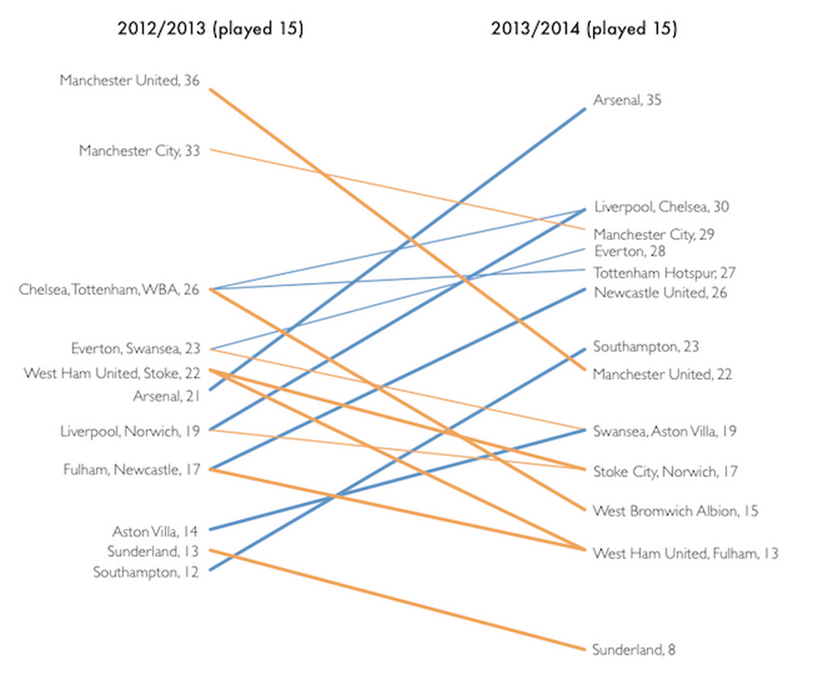</img></a>

nD/Multidimensional
========================================================
## Slopegraph resources
* [Tableau Public](https://public.tableau.com/s/)
* [Excel](http://stephanieevergreen.com/slopegraph/)
* [d3](http://bl.ocks.org/biovisualize/4348024)

nD/Multidimensional
========================================================
## Sparklines

</img>

nD/Multidimensional
========================================================
## Sparklines

<a href="http://trendct.org/2015/09/17/how-much-people-spend-on-rent-in-connecticut/">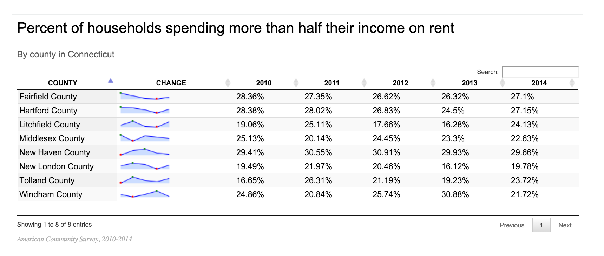</img></a>

nD/Multidimensional
========================================================
## Sparklines resources

* [Google sheets](http://thenextweb.com/insider/2014/12/09/google-docs-now-lets-add-miniature-graphs-charts-within-cells/)
* [Excel](http://chandoo.org/wp/2010/03/22/excel-sparkline-template/)
* [Highcharts](http://www.highcharts.com/demo/sparkline)

nD/Multidimensional
========================================================
## Radar/spider chart

<a href="http://trendct.org/2015/09/17/how-much-people-spend-on-rent-in-connecticut/">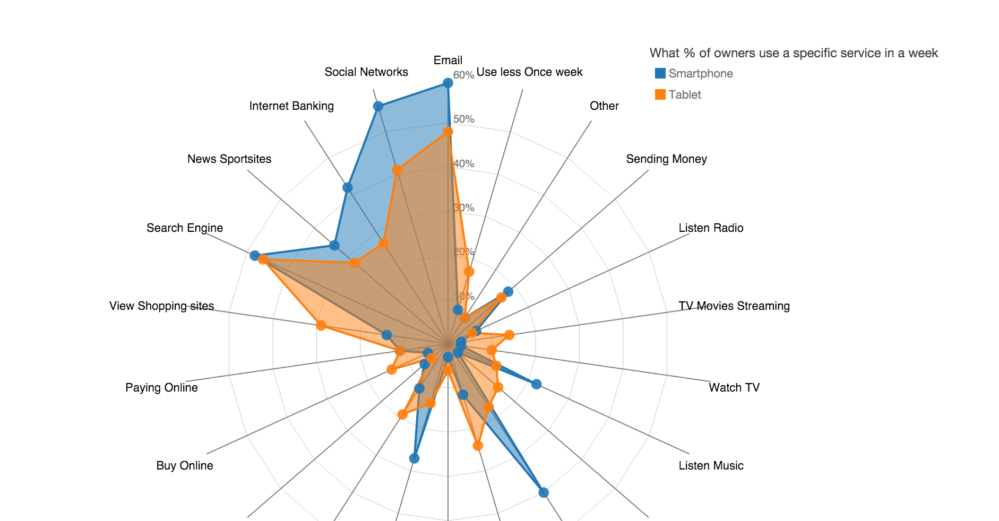</img></a>

nD/Multidimensional
========================================================
## Box and whisker plot/candlestick chart

</img>

nD/Multidimensional
========================================================
## Box and whisker plot/candlestick chart

</img>

nD/Multidimensional
========================================================
## Small multiples

<a href="http://www.npr.org/2015/09/10/319535020/coal-gas-nuclear-hydro-how-your-state-generates-power">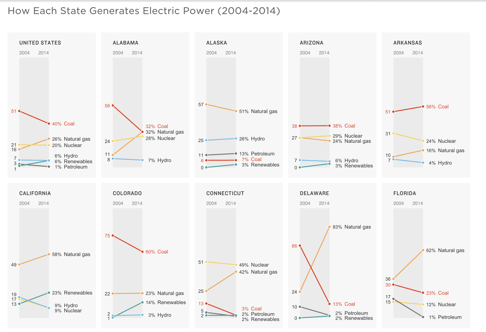</img>

nD/Multidimensional
========================================================
## Small multiples

<a href="http://www.npr.org/2015/09/10/319535020/coal-gas-nuclear-hydro-how-your-state-generates-power"></img></a>

nD/Multidimensional
========================================================
## Small multiples - [LATimes](https://instagram.com/p/xGIU6Vp8QG/?taken-by=latimes)

<blockquote class="instagram-media" data-instgrm-captioned data-instgrm-version="5" style=" background:#FFF; border:0; border-radius:3px; box-shadow:0 0 1px 0 rgba(0,0,0,0.5),0 1px 10px 0 rgba(0,0,0,0.15); margin: 1px; max-width:658px; padding:0; width:99.375%; width:-webkit-calc(100% - 2px); width:calc(100% - 2px);">
 
 

 
 <a href="https://instagram.com/p/xGIU6Vp8QG/" style=" color:#000; font-family:Arial,sans-serif; font-size:14px; font-style:normal; font-weight:normal; line-height:17px; text-decoration:none; word-wrap:break-word;" target="_blank">What a year of #drought looks like. #california #thirsty #map #gif</a>
 
A video posted by Los Angeles Times (@latimes) on <time style=" font-family:Arial,sans-serif; font-size:14px; line-height:17px;" datetime="2014-12-27T03:53:32+00:00">Dec 26, 2014 at 7:53pm PST</time>

</blockquote>

nD/Multidimensional
========================================================
## Small multiples - [LATimes](http://www.latimes.com/science/la-me-g-california-drought-map-htmlstory.html)

<a href="http://www.latimes.com/science/la-me-g-california-drought-map-htmlstory.html">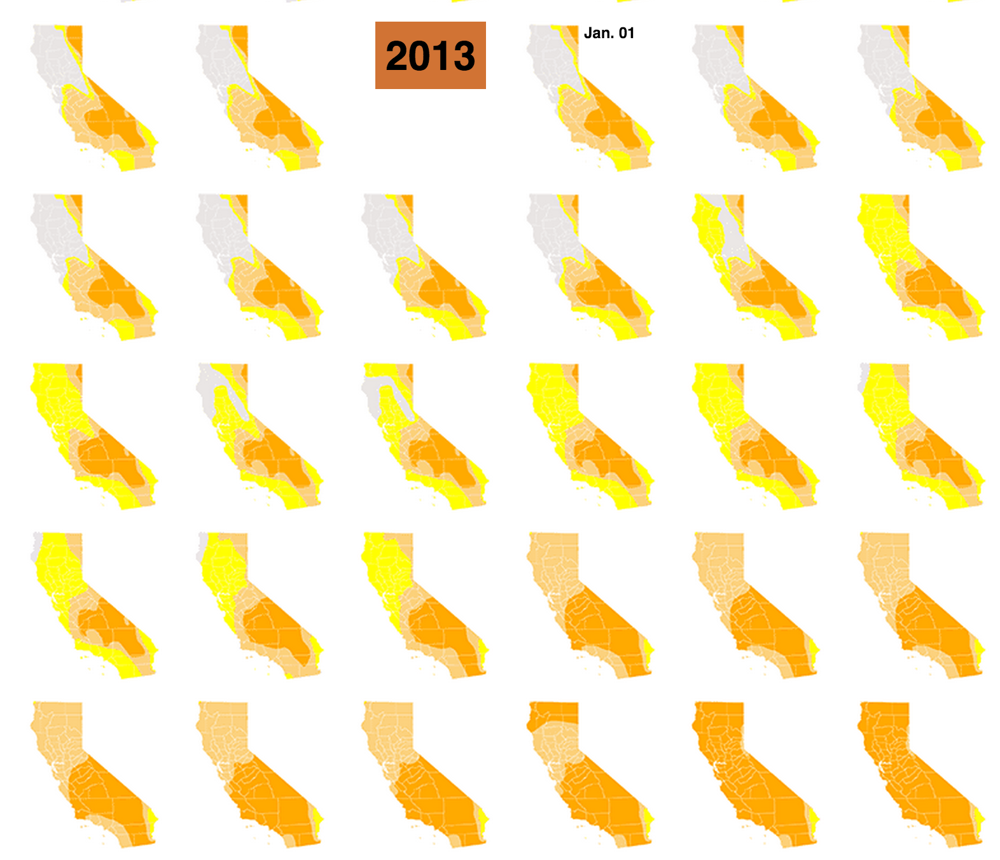</img></a>

nD/Multidimensional
========================================================
## Small multiples resources
* [d3](http://bl.ocks.org/mbostock/1157787)
* [Plotly](http://plot.ly)

Network
========================================================

## Chord diagram

</img>

Network
========================================================

## Chord diagram

* [Cloudstitch](http://www.cloudstitch.com/newsroom)
* [d3](http://bl.ocks.org/mbostock/4062006)
