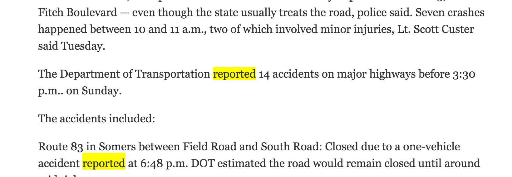

Finding official data
========================================================
author: Andrew Tran
date: October 14, 2015

Data scavenger hunt
========================================================

Start out with a question, like

## How many traffic accidents are there in CT?

Data scavenger hunt
========================================================

Ask yourself: 

* Who would have that data? 

Data scavenger hunt
========================================================
Ask Google:

## "Traffic accidents, Connecticut"

Data scavenger hunt
========================================================

Clues: News sites and government sites (ends with **.gov**)

</img>

Data scavenger hunt
========================================================

Where's the data in the news story sourced from? 

Search for:

* "according to"
* "reported"
* "said"

</img>

Data scavenger hunt
========================================================

Find a government agency who might have the data.

Data scavenger hunt
========================================================

Find a government agency who might have the data.

Complicated. Because like bureacracies, government websites can be difficult to navigate.

Data scavenger hunt
========================================================

Find a government agency who might have the data.

Complicated. Because like bureacracies, government websites can be difficult to navigate.

Data scavenger hunt
========================================================

**Tips**:

* Go to main page (home)
* Look for the press contact (Usually under **Contact Us** or **Directory**)
 * If that doesn't work, search for press releases
 * Usually a press contact's phone number and email will be listed on the press release
* Use advanced Google search techniques
 * whatever data you want plus site:agencysite.gov. (For example, "accidents site: portal.ct.gov")
* Try [Let Me Get That Data For You](http://lmgtdfy.usopendata.org/)

Data scavenger hunt
========================================================

## 80 percent of the time, getting data is as simple as asking someone at some department or agency if the data I'm looking for exists.

Data scavenger hunt
========================================================

## 80 percent of the time, getting data is as simple as asking someone at some department or agency if the data I'm looking for exists.

## The other times? 

## Freedom of Information Requests

Data scavenger hunt
========================================================

## What is a FOIA?

Data scavenger hunt
========================================================

## What is a FOIA?

Since 1967, the Freedom of Information Act (FOIA) has provided the public the right to request access to records from any federal agency.  

It is often described as the law that keeps citizens in the know about their government. 

Federal agencies are required to disclose any information requested under the FOIA unless it falls under one of nine exemptions which protect interests such as personal privacy, national security, and law enforcement.

Data scavenger hunt
========================================================

## FOIA Exemptions?

1. Information that is classified to protect national security.

Data scavenger hunt
========================================================

## FOIA Exemptions?

1. Information that is classified to protect national security.
2. Information related solely to the internal personnel rules and practices of an agency.

Data scavenger hunt
========================================================

## FOIA Exemptions?

1. Information that is classified to protect national security.
2. Information related solely to the internal personnel rules and practices of an agency.
3. Information that is prohibited from disclosure by another federal law.

Data scavenger hunt
========================================================

## FOIA Exemptions?

1. Information that is classified to protect national security.
2. Information related solely to the internal personnel rules and practices of an agency.
3. Information that is prohibited from disclosure by another federal law.
4. Trade secrets or commercial or financial information that is confidential or privileged.

Data scavenger hunt
========================================================

## FOIA Exemptions?

* Information that is classified to protect national security.
* Information related solely to the internal personnel rules and practices of an agency.
* Information that is prohibited from disclosure by another federal law.
* Trade secrets or commercial or financial information that is confidential or privileged.
*  Privileged communications within or between agencies, including:
  * Deliberative Process Privilege
  * Attorney-Work Product Privilege
  * Attorney-Client Privilege
  
  Data scavenger hunt
========================================================

## FOIA Exemptions?

* Information that, if disclosed, would invade another individual's personal privacy.
* Information compiled for law enforcement purposes that:
  * Could reasonably be expected to interfere with enforcement proceedings
  * Would deprive a person of a right to a fair trial or an impartial adjudication
  * Could reasonably be expected to constitute an unwarranted invasion of personal privacy
  * Could reasonably be expected to disclose the identity of a confidential source

  Data scavenger hunt
========================================================

## FOIA Exemptions?

* Information compiled for law enforcement purposes that:
  * Would disclose techniques and procedures for law enforcement investigations or prosecutions
  * Could reasonably be expected to endanger the life or physical safety of any individual
* Information that concerns the supervision of financial institutions.
* Information on wells

FOIA Resources
========================================================

## MuckRock.com

* [MuckRock makes FOIA requests easy, but will reporters use it? » Nieman Journalism Lab](http://www.niemanlab.org/2010/10/muckrock-makes-foia-requests-easy-but-will-reporters-use-it/)
* [MuckRock • We have over half the country's agency-by-agency 1033 data ...](https://www.muckrock.com/news/archives/2014/sep/04/we-have-over-half-countrys-agency-agency-1033-data/)
* [MRAPs And Bayonets: What We Know About The Pentagon's 1033 Program : NPR](http://www.npr.org/2014/09/02/342494225/mraps-and-bayonets-what-we-know-about-the-pentagons-1033-program)
* [Mapping the Spread of the Military’s Surplus Gear - The New York Times](http://www.nytimes.com/interactive/2014/08/15/us/surplus-military-equipment-map.html?_r=0)
* [The Flow of Money and Equipment to Local Police - The New York Times](http://www.nytimes.com/interactive/2014/08/23/us/flow-of-money-and-equipment-to-local-police.html)

Michael Morisy
========================================================

Michael Morisy ([@morisy](http://twitter.com/morisy)) is the co-founder of investigative news startup MuckRock. He is also a John S. Knight Journalism Fellow at Stanford.

Previously, Morisy was the founding editor of BetaBoston for the Boston Globe, working with a team of journalists, designers, developers, and more to create the Greater Boston area’s preeminent tech and startup news site. Before that, he was a technology reporter and editorial director at various TechTarget websites, including running the question-and-answer site and blog network ITKnowledgeExchange.

Morisy played a part in two Pulitzer Prize-winning series: The 2007 Editorial Winner “9/11: The Forgotten Victims,” for the New York Daily News, which he wrote and reported; and the Boston Globe’s 2014 Breaking News coverage of the Boston Bombings.

More FOIA tips
========================================================
* Before requesting, check to see if the data is already available elsewhere or requested by others

More FOIA tips
========================================================
* Before requesting, check to see if the data is already available elsewhere or requested by others
* Plan ahead to save time. Because submitting a formal request takes time to respond to, you can maximize your time by researching while the request is pending.

More FOIA tips
========================================================
* Before requesting, check to see if the data is already available elsewhere or requested by others
* Plan ahead to save time. Because submitting a formal request takes time to respond to, you can maximize your time by researching while the request is pending.
* Check the rules about fees

More FOIA tips
========================================================
* Before requesting, check to see if the data is already available elsewhere or requested by others
* Plan ahead to save time. Because submitting a formal request takes time to respond to, you can maximize your time by researching while the request is pending.
* Check the rules about fees
* As for electronic documents to avoid copying and posting costs

More FOIA tips
========================================================
* Before requesting, check to see if the data is already available elsewhere or requested by others
* Plan ahead to save time. Because submitting a formal request takes time to respond to, you can maximize your time by researching while the request is pending.
* Check the rules about fees
* As for electronic documents to avoid copying and posting costs
* Know your rights, like time limit for replies
* Start simple then add more questions after getting initial information.

More FOIA tips
========================================================
* Before requesting, check to see if the data is already available elsewhere or requested by others
* Plan ahead to save time. Because submitting a formal request takes time to respond to, you can maximize your time by researching while the request is pending.
* Check the rules about fees
* As for electronic documents to avoid copying and posting costs
* Know your rights, like time limit for replies
* Start simple then add more questions after getting initial information.
* Keep it focused

More FOIA tips
========================================================
* Before requesting, check to see if the data is already available elsewhere or requested by others
* Plan ahead to save time. Because submitting a formal request takes time to respond to, you can maximize your time by researching while the request is pending.
* Check the rules about fees
* As for electronic documents to avoid copying and posting costs
* Know your rights, like time limit for replies
* Start simple then add more questions after getting initial information.
* Keep it focused
* Think inside the filing cabinet.(Like if you have a form police fills out after accidents)

More FOIA tips
========================================================
* Be specific

More FOIA tips
========================================================
* Be specific
* Submit multiple requests

More FOIA tips
========================================================
* Be specific
* Submit multiple requests
* Anticipate the exemptions

More FOIA tips
========================================================
* Be specific
* Submit multiple requests
* Anticipate the exemptions
* Ask for access to the files

More FOIA tips
========================================================
* Be specific
* Submit multiple requests
* Anticipate the exemptions
* Ask for access to the files
* Keep a record of everything

More FOIA tips
========================================================
* Be specific
* Submit multiple requests
* Anticipate the exemptions
* Ask for access to the files
* Keep a record of everything
* Go public

More FOIA tips
========================================================
* Be specific
* Submit multiple requests
* Anticipate the exemptions
* Ask for access to the files
* Keep a record of everything
* Go public
* Ask for raw data

More FOIA tips
========================================================
* Be specific
* Submit multiple requests
* Anticipate the exemptions
* Ask for access to the files
* Keep a record of everything
* Go public
* Ask for raw data
* Don't start out adversarial
* Keep bugging them. They want you to give up.

More FOIA Resources
========================================================
* [FOIA.gov](http://www.foia.gov/faq.html)
* [openFOIA > Freedom of Information Act](https://open.foia.gov/)
* [Freedom of Information Requests | Data | City of Hartford](https://data.hartford.gov/Community/Freedom-of-Information-Requests/syjv-fm5n)
* **[#FOIAFridays](https://twitter.com/search?q=foiafridays&src=typd)** on Twitter

Amazing stories from FOIA battles
========================================================
* [Dallas ISD personnel chief, a deputy resign after release of instant messages poking fun at race, age | Dallas Morning News](http://www.dallasnews.com/news/education/headlines/20150129-in-instant-messages-dallas-isd-administrators-poke-fun-at-race-and-age-disparage-coworkers.ece)
* [Chicago’s Criminals Are Getting Away With Murder | Chicago magazine | May 2013](http://www.chicagomag.com/Chicago-Magazine/May-2013/Getting-Away-with-Murder/)
